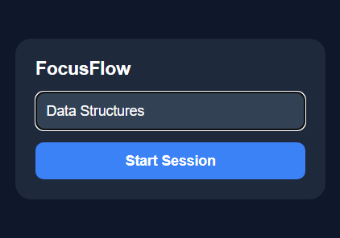
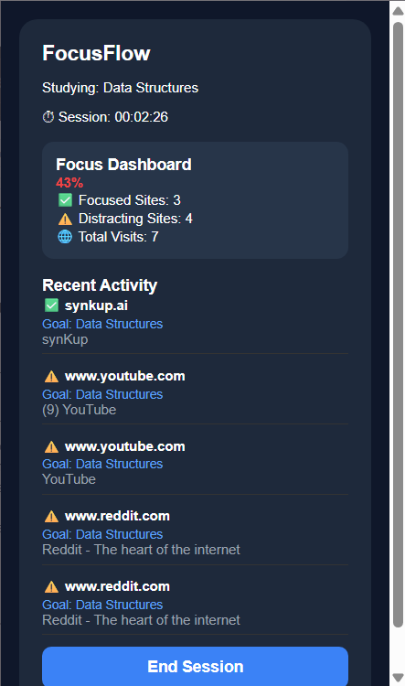
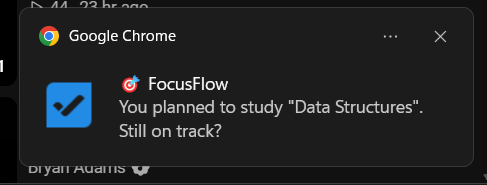
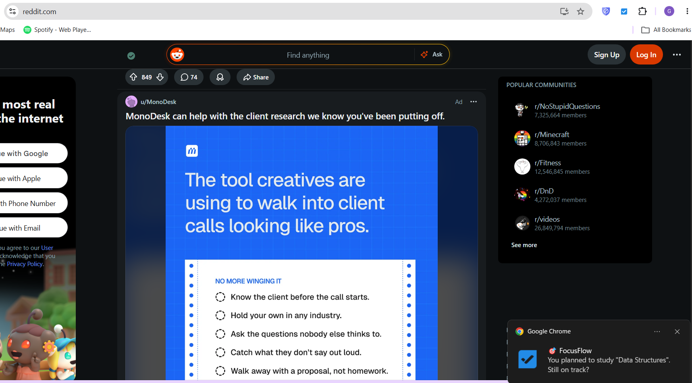

# FocusFlow

FocusFlow is an AI-powered Chrome extension designed to help students stay focused while studying. It monitors browsing activity during study sessions, identifies distracting websites, and intelligently analyzes YouTube videos using the Gemini API to determine whether they are relevant to the user's study goal.

The project was built to solve a common productivity problem: unintentionally drifting from educational content into distractions while studying online.

---

## Features

- Start and end personalized study sessions
- Real-time session timer
- Focus dashboard with productivity statistics
- Browsing activity tracker
- AI-powered YouTube relevance detection using Google Gemini
- Instant distraction notifications
- Recent browsing history for each session
- Automatic focus score calculation

---

## How It Works

1. The user starts a study session by entering a goal.
2. The extension monitors websites visited during the session.
3. Websites such as Reddit, Instagram, Facebook, Netflix, and X are immediately marked as distracting.
4. For YouTube, the extension uses the Gemini API to determine whether the video matches the user's study goal.
5. If distracting content is detected, the user receives a reminder notification.
6. Throughout the session, FocusFlow records browsing activity and displays productivity statistics in the dashboard.

---

## Technology Stack

### Frontend
- React
- TypeScript
- Vite

### Chrome Extension
- Manifest V3
- Chrome Storage API
- Chrome Tabs API
- Chrome Notifications API

### Artificial Intelligence
- Google Gemini API

---

## Project Structure

```
FocusFlow/
│
├── public/
│   ├── background.js
│   ├── manifest.json
│   └── icon.png
│
├── src/
│   ├── App.tsx
│   ├── main.tsx
│   ├── index.css
│   ├── engine/
│   └── services/
│
├── package.json
└── README.md
```

---

## Screenshots

### Main Layout



---

### Dashboard



---

### Notification



---

### Website Activity



---

## Installation

Clone the repository.

```bash
git clone https://github.com/YOUR_USERNAME/FocusFlow.git
```

Navigate to the project.

```bash
cd FocusFlow
```

Install dependencies.

```bash
npm install
```

Build the extension.

```bash
npm run build
```

Open Chrome and navigate to:

```
chrome://extensions
```

- Enable **Developer Mode**
- Click **Load unpacked**
- Select the project's `dist` folder

---

## Configuration

This project uses the Google Gemini API for YouTube relevance analysis.

Replace the placeholder API key with your own before running the extension.

```javascript
const GEMINI_API_KEY = "YOUR_API_KEY";
```

---

## Future Improvements

- Website blocking mode
- Pomodoro timer
- Weekly productivity analytics
- AI study assistant
- Custom distraction lists
- Session history
- Export statistics as PDF or CSV
- Cloud synchronization

---

## Motivation

Most productivity extensions simply block websites. FocusFlow takes a different approach by understanding the user's intent. Instead of blocking YouTube entirely, it uses AI to determine whether the content supports the user's study goal, allowing educational videos while discouraging distractions.

---

## Author

**Gurnoor Kaur**

Computer Science student passionate about building practical software solutions using Artificial Intelligence, Web Technologies, and Data Science.